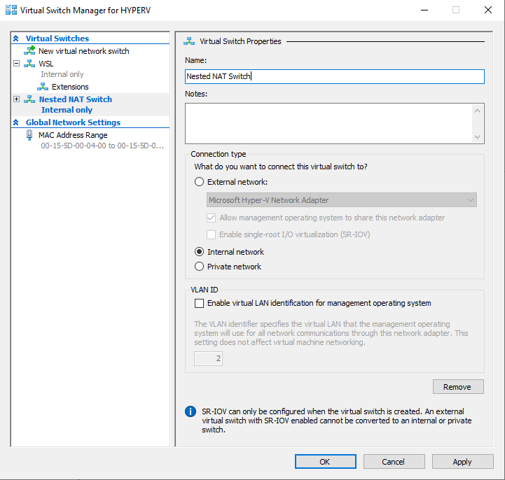
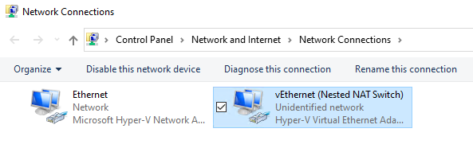
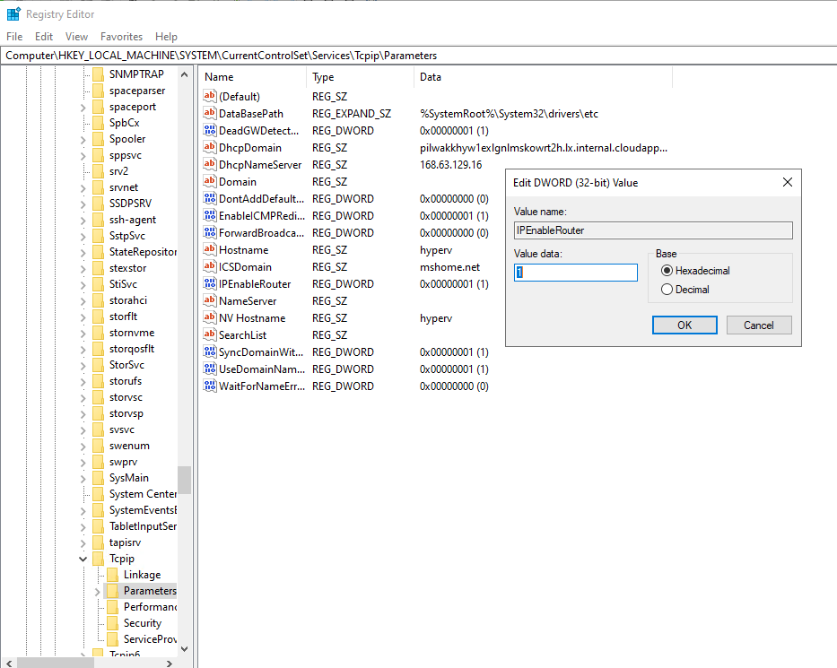
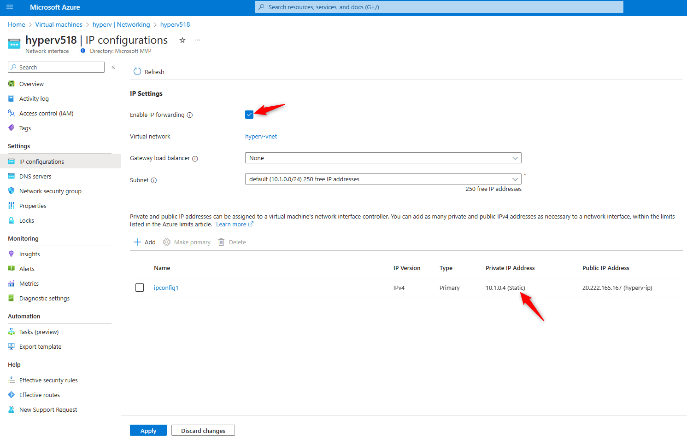
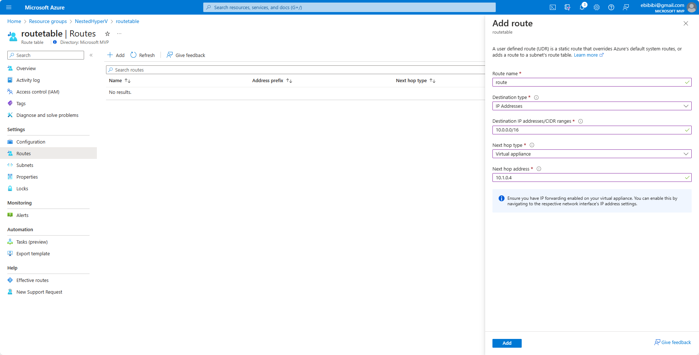
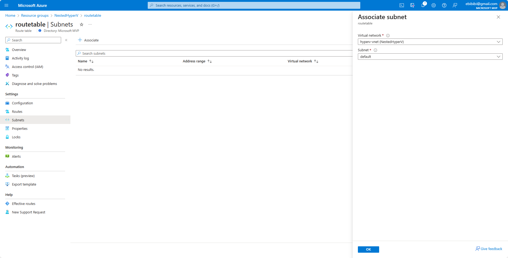

# このドキュメントについて

このレポジトリにあるplaybookが実行できるようになるまでの手順です。

## Hyper-Vホスト準備

Hyper-Vのホストはどのように準備しても構いませんが、検証用環境構築の目的での利用であればNested Hyper-Vを有効化したホストを利用するのが環境依存部分がなくなりオススメです。下記動画を参考にしてください。

* [Nested Hyper\-Vで検証基盤を準備 / 企業でよくあるWindows, M365環境を構築してみるシリーズ Part1 \- YouTube](https://www.youtube.com/watch?v=5rG_3MxpFzQ&list=PLas-S4LkjlLr27Dy5x80qUNvVFCPDb9fX&index=3)

もちろん物理的なサーバー上で直接構成することも可能です。

PowerShellでHyper-Vロールの追加は下記のコマンドで可能です。

    Install-WindowsFeature -Name Hyper-V -IncludeManagementTools -Restart

### Windows上でWinRMを有効化し、Ansibleで管理可能にする(PowerShellコンソールで実行)

    Invoke-WebRequest -Uri https://gist.githubusercontent.com/ebibibi/e0ad7a2401442d03a128fb359f5e6411/raw/1e9a95ad094a11ff3bda1bb5a17985b2c9812cbf/ConfigureRemotingForAnsible.ps1 -OutFile ConfigureRemotingForAnsible.ps1
    powershell -ExecutionPolicy RemoteSigned .\ConfigureRemotingForAnsible.ps1

### Ansible実行環境をWSL上に準備する(PowerShellコンソールで実行)

    wsl --install ubuntu

コマンド実行後Windowsを再起動します。再起動後にwslを起動します。

    wsl -d Ubuntu

### WSL上のUbuntu環境を最新の状態にする(WSL上で実行)

    sudo apt update
    sudo apt upgrade

### WSL上へのAnsible導入(WSL上で実行)

    sudo apt install python3-pip git libffi-dev libssl-dev -y
    pip install pywinrm
    sudo apt install ansible

### Ansibleへのコミュニティモジュールの追加
    
    ansible-galaxy collection install community.windows

### boxstarterを使ったgit, vscodeのインストール(PowerShellコンソールで実行)

もちろん、手動でインストールしてもらって構いませんが、下記で省力化できます。

    . { iwr -useb https://boxstarter.org/bootstrapper.ps1 } | iex; Get-Boxstarter -Force
    Install-BoxstarterPackage -PackageName https://gist.githubusercontent.com/ebibibi/cc53c859f2af91737889c2a6f6eb0aa5/raw/bb47a879f30597ed11b351eb09ad5969dce5071f/boxstarter.txt

### このGithubレポジトリをローカルにクローン(PowerShellコンソールで実行)

レポジトリをクローンします。Windows上でもWSLのUbuntu上のどちらでもいいのですが、個人的にはWindows上にCloneしておきVSCodeを使って編集するのが好みです。

その場合にはUbuntuからは/mnt/c/repos/ansible-hyper-vのようにアクセスできます。

    mkdir repos
    cd repos
    git clone https://github.com/ebibibi/ansible-hyperv.git
    cd ansible-hyperv

### Hyper-V仮想スイッチの準備

仮想スイッチを1つ作成し、任意の名前を付けます。WSLがすでに1つ作成していますがそれとは別で作成すると良いでしょう。名前は`Environments.yml`の記述と一致させる必要があります。

サンプルでは`Nested NAT Switch`という名前になっています。

仮想スイッチの種類は任意のもので構いませんが、オススメは内部スイッチです。

Hyper-Vホストをルーターとして構成しVM <-> Hyper-Vホスト <-> 外部という形でルーティングを行うのが良いでしょう。

### Hyper-Vホストのネットワーク準備

Hyper-VホストはゲストVMと直接通信できる必要があります。準備した仮想スイッチに接続するNICにネットワーク設定を割り当てます。
具体的にはVMの持つNICに割り当てるネットワークと同じネットワークに所属させます。

Azure上のホストの場合にはIPアドレスを割り当てるNICを間違えると完全に通信できない状態になってしまうので注意してください。元から存在し、通常の通信用に使用しているNICはDHCPで構成されており、それを変更してはいけません。

`Nested NAT Switch`という名前でスイッチを作成したのであれば`vEthernet (Nested NAT Switch)`という名前のNICをVMと通信できるように構成します。

サンプルとしてはこのレポジトリでは10.1.1.0/24のネットワークをVMが利用するネットワーク=（Nested NAT Switchが利用するネットワーク）としています。さらにHyper-Vホストをゲートウェイとして10.1.1.254というIPアドレスで指定しています。

この場合、Nested NAT Switchという仮想スイッチを作成したことで自動作成されているNICへ10.1.1.254というIPアドレスを割り当てるには下記のコマンドを実行すればよいです。

    New-NetIPAddress -InterfaceAlias "vEthernet (Nested NAT Switch)" -IPAddress 10.1.1.254 -PrefixLength 24

ゲストVMを外部と通信できるようにするにはルーティングを有効にしてあげるか、NATを構成する必要があります。どちらを選択するかはゲストVMがどことどのように通信できるか次第なので、用途に応じて選択してもらう必要があります。

## (典型例1)ゲストVMのためにルーティングを構成

Windowsでルーティングを構成するのはRRASで構成するのが正しいのではと思いますが、RRASのルーティングはWindows Server 2016以降で上手く動作しない模様です。その代わりにレジストリを設定することでルーティングを有効化可能です。

「HKEY_LOCAL_MACHINE\SYSTEM\CurrentControlSet\Services\Tcpip\Parameters\IPEnableRouter」を「1」に設定します。

PowerShellで実行する場合には下記のコマンドを実行します。

    Set-ItemProperty -Path "HKLM:\SYSTEM\CurrentControlSet\Services\Tcpip\Parameters" -Name "IPEnableRouter" -Value 1

Windows Server 2025では上記の設定ではルーティングは有効になりませんでした。代わりにというか本来通り「ルーティングとリモートアクセス」でルーティングを有効化する事が可能です。

また、このように構成するとVMが存在しているネットワークは孤立したものになります。Hyper-Vホストでだけルーティングを有効にしてもその先にいる他のホストやネットワーク機器はVMが存在しているネットワークの事は知りません。ですので、通信するホストにスタティックルートを記載するなりルーターのルーティングテーブルを操作するなりしないといけません。

具体的にはたとえばAzureであればスタティックルートを作成します。

あらかじめHyper-Vホストが保持するNICのIP構成を静的にし、IPフォワーディングを有効化しておきます。

そのうえで、ルートテーブルを作成します。

サブネットに割り当てます。

以上でルーティングが可能です。

その他の構成の場合には、ルーター等適切な場所にルートを記載してください。

## (典型例2)Hyper-VホストでNATを構成する

外部からVMへの通信は必要なく、VMからインターネット等の外部への通信のみができれば良い場合にはHyper-Vホスト上でNATを構成するのがオススメです。

たとえば、VMが存在するネットワークが10.1.1.0/24でそのネットワークからの通信をNATしてデフォルトルートに送信するように構成するには下記のコマンドをPowerShellで実行します。

    New-NetNAT -Name "NATNetwork" -InternalIPInterfaceAddressPrefix "10.1.1.0/24"

## sysprep実行済みイメージを任意の場所に配置

配置した場所を `Environments.yml` 上に記載してください。
sysprep実行済みのイメージの作成に関して不明点あれば下記を参考に作成、準備してください。

### Windows Serverのsysprep実行済みイメージを作成する

このイメージ準備はコマンドのみでというわけにもいかないので、下記のYoutube動画をご覧ください。
* [sysprepでWindows Serverの雛形を作成する / 企業でよくあるWindows, M365環境を構築してみるシリーズ Part2 \- YouTube](https://www.youtube.com/watch?v=m5pFUegs6CY&list=PLas-S4LkjlLr27Dy5x80qUNvVFCPDb9fX&index=3)
* [ADK, SIMを使って応答ファイルを作成しsysprep実行後の構成を自動化する / 企業でよくあるWindows, M365環境を構築してみるシリーズ Part3 \- YouTube](https://www.youtube.com/watch?v=wOHfoPphjMY&list=PLas-S4LkjlLr27Dy5x80qUNvVFCPDb9fX&index=4)

応答ファイルは下記が使えます。
* https://gist.github.com/ebibibi/7c22b53ba6d8d9742a415994c5592bfc

### (ホストではなくマスターにするVM上の操作)Windows上でWinRMを有効化し、Ansibleで管理可能にする(PowerShellコンソールで実行)

    Invoke-WebRequest -Uri  https://gist.githubusercontent.com/ebibibi/e0ad7a2401442d03a128fb359f5e6411/raw/1e9a95ad094a11ff3bda1bb5a17985b2c9812cbf/ConfigureRemotingForAnsible.ps1 -OutFile ConfigureRemotingForAnsible.ps1
    powershell -ExecutionPolicy RemoteSigned .\ConfigureRemotingForAnsible.ps1

### (ホストではなくマスターにするVM上の操作)自動応答ファイルをc:\windows\system32\sysprepに配置したうえでsysprep実行

    # Win2022_answerfile.xmlをc:\windows\system32\sysprepにコピー
    c:\windows\system32\sysprep\sysprep.exe /generalize /oobe /shutdown /unattend:win2022_answerfile.xml

## hosts, vars/Environments.yml, group_vars/all.ymlの編集

`hosts`,`vars/Environments.yml`および`group_vars/all.yml`を環境に合わせて編集します。とくに`group_vars/all/vars.ymll`にはWindows環境へアクセスするための認証情報も記載されています。もしも、ホストによって認証情報が異なる場合には、`hosts`に記載されているグループ毎に`group_vars/xxx.yml`というファイルを個別に作成し認証情報をそれぞれに記載するようにしてください。

## パスワードの暗号化

パスワードを直接生で記載するのは良くないため、vaultを利用します。

group_vars/all/vault.ymlというファイルを新規に作成し、そこにvault_ansible_passwordを定義します。パスワードはご自身のものに変更してください。

    echo "vault_ansible_password: my_secret_password" > group_vars/all/vault.yml
    echo "vault_host_password: my_secret_password" >> group_vars/all/vault.yml

次にこのファイルを暗号化します。Ubuntu（WSL）上で操作します。

    ansible-vault encrypt group_vars/all/vault.yml

これで暗号化されます。ここで定義しているvault_ansible_passwordは下記のようにgroup_vars/all/vars.yml内で参照されています。

    ansible_user: Administrator
    ansible_password: "{{ vault_ansible_password }}"

また、サンプルはHyper-Vホストのパスワードは別という例になっています。これはgroup_vars/hyperv.yml内で参照されています。

    ansible_user: Administrator
    ansible_password: "{{ vault_host_password }}"

# hostsへの追加
ansibleでWindowsホストにアクセスするためのIPアドレスは環境によって異なります。
なので、ここではhypervhostという名称でhostsに書き込んでしまう事にします。

まずWindows上でipconfigを実行し、WSLのNICに割り当てられているIPアドレスを確認してください。
典型的には'イーサネット アダプター vEthernet (WSL (Hyper-V firewall))'という名称になっていると思います。
確認したIPアドレスをhostsに書き込みます。WSL2のUbuntu上で実行してください。

    # Windows ホストの IP を取得
    win_ip=(確認したIPアドレスをここに記載)
    # /etc/hosts にエントリを追加（すでにある場合は更新）
    sudo sed -i "/^$win_ip\s\+hypervhost$/d" /etc/hosts
    echo "$win_ip hypervhost" | sudo tee -a /etc/hosts

これでhostに下記のように書いてあるままでアクセスできるようになります。

以上で準備は完了です。playbookが実行可能です。

## playbook実行方法(の例)
- WSL2を起動
- cd /mnt/c/repos/ansible-hyperv（※gitレポジトリまで移動）
- ansible-playbook -i hosts create_ad.yml --ask-vault-pass

# トラブルシューティング

## Windows Serverにansibleから接続できない
- WinRMが有効化されていることを確認してください。
- group_vars/all.ymlに接続で利用するユーザー名、パスワード等が記載されていますので環境に合わせて書き換えてください。
- 場合によってはgroup_vars/xxxx.ymlを作成し、グループ毎の接続設定を個別に設定してもら手も構いません。
- winrm quickconfig　を実行して、再度WinRMを構成してください。
- HTTPSリスナーを再構成することで解決するケースも多いです。

    # 現在の設定の確認
    winrm enumerate winrm/config/listener

    # リスナーの削除(下記の<Address>は実際のAddressに置き換えて実行)
    winrm delete winrm/config/Listener?Address=<Address> +Transport=HTTPS

    # 新しい自己署名証明書の作成
        New-SelfSignedCertificate -DnsName "your.server.fqdn" -CertStoreLocation Cert:\LocalMachine\My
    Get-ChildItem -Path Cert:\LocalMachine\My | Where-Object { $_.Subject -like "*your.server.fqdn*" }
    
    # リスナーの作成
    winrm create winrm/config/Listener?Address=*+Transport=HTTPS @{Hostname="your.server.fqdn"; CertificateThumbprint="サムプリント値"}

